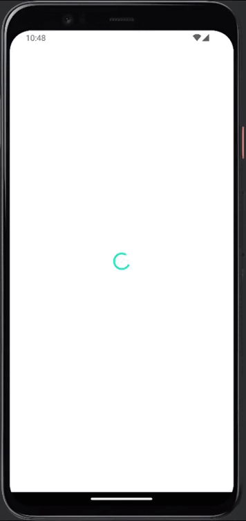

# Quiz

Мобільний додаток "Квіз" який доволяє перевірити знання правил дорожнього руху. Після запуску додатку відкриваться сторінка сайту яку необідно "прорекламувати" користувачу. Після закриття сайту відкриваться квіз.

## Реаліовано

- Після запуску додатку рендериться `loader` доки йде з'єднання з сайтом. Якщо вказаний сайт існує то рендериться цей сайт, якщо ні або з'єдняння невдале - квіз.

- Екран `Webpage`:
  - Рендер вказаної сторінки за допомогою компонента `WebView`;
  - Кнопка закриття сторінки. Після натиснення рендериться екран Quiz.

- Екран `Quiz`:
  - компонент `Welcome`. Сторінка-привітання з описом квізу та кнопкою "Розпочати";
  - компонент `Progress`. Показує прогрес відповідей: номер поточного питання та їх загальну кількість.
  - компонент `QuestionCard`. Рендер картки з питанням та варіантами відповідей. Після написнення на відповідь, якщо вона правильна то підсвічуться зеленим кольором. У разі вибору неправильної відповіді - підсвічується червоним, а зеленим - правильна. Після цього можна перейти до наступного питання натисканням кнопки "Наступне питання";
  - компонент `ModalWindow`. Після відповіді на останнє питання рендериться модальне вікно з результатом (який відразу записуться до локального сховища), кнопкою "Спробувати ще раз", яка дає змогу почати квіз спочатку, та кнопкою "Попередні результати", яка рендерить компонент `Resutls`. Він дає змогу подивитись результати попередніх ігор, які збережені у локальному сховищі.

## Використані тенології:

